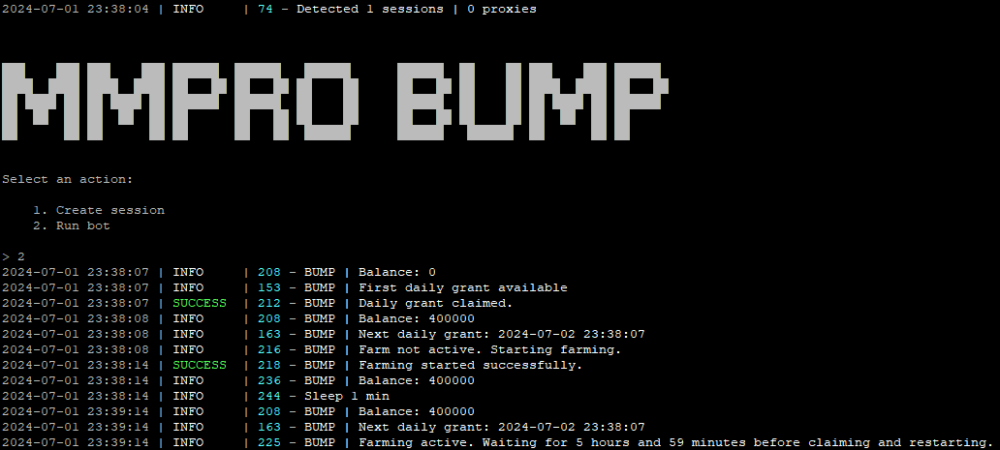

# Bot for [MMPro Bump](https://alexell.ru/cc/mmpro)



> 🇷🇺 README на русском доступен [здесь](README-RU.md)

## Functionality
| Feature                                                        | Supported  |
|----------------------------------------------------------------|:----------:|
| Multithreading                                                 |     ✅     |
| Binding a proxy to a session                                   |     ✅     |
| Auto-claim daily grant                                         |     ✅     |
| Automatic farming                                              |     ✅     |
| Automatic taps that account for enabled boosts                 |     ✅     |
| Docker                                                         |     ✅     |

## [Options](https://github.com/Alexell/MMProBumpBot/blob/main/.env-example)
| Option                  | Description                                                                   |
|-------------------------|----------------------------------------------------------------------------|
| **API_ID / API_HASH**   | Platform data from which to launch a Telegram session (stock - Android)    |
| **USE_PROXY_FROM_FILE** | Whether to use proxy from the `bot/config/proxies.txt` file (True / False) |

You can obtain the **API_ID** and **API_HASH** after creating an application at [my.telegram.org/apps](https://my.telegram.org/apps)

## Quick start
### Windows
1. Ensure you have **Python 3.10** or a newer version installed.
2. Use `INSTALL.bat` to install, then specify your API_ID and API_HASH in the .env file.
3. Use `START.bat` to launch the bot (or in the console: `python main.py`).

### Linux
1. Clone the repository: `git clone https://github.com/Alexell/MMProBumpBot.git && cd MMProBumpBot`
2. Run the installation: `chmod +x INSTALL.sh START.sh && ./INSTALL.sh`, then specify your API_ID and API_HASH in the .env file.
3. Use `./START.sh` to run the bot (or in the console: `python3 main.py`).

## Docker
```shell
~ >>> git clone https://github.com/Alexell/MMProBumpBot.git
~ >>> cd MMProBumpBot
~ >>> cp .env-example .env
~ >>> nano .env # specify your API_ID and API_HASH, the rest can be left as default
```
### Docker Compose (recommended)
```shell
~ >>> docker-compose run bot -a 1 # first run for authorization (override arguments)
~ >>> docker-compose start # start in background mode (default arguments: -a 2)
```
### Docker
```shell
~ >>> docker build -t mmpro_bump_bot .
~ >>> docker run --name MMProBumpBot -v .:/app -it mmpro_bump_bot -a 1 # first run for authorization
~ >>> docker rm MMProBumpBot # remove container to recreate with default arguments
~ >>> docker run -d --restart unless-stopped --name MMProBumpBot -v .:/app mmpro_bump_bot # start in background mode (default arguments: -a 2)
```

## Manual installation
You can download [**Repository**](https://github.com/Alexell/MMProBumpBot) by cloning it to your system and installing the necessary dependencies:
```shell
~ >>> git clone https://github.com/Alexell/MMProBumpBot.git
~ >>> cd MMProBumpBot

# Linux
~/MMProBumpBot >>> python3 -m venv venv
~/MMProBumpBot >>> source venv/bin/activate
~/MMProBumpBot >>> pip3 install -r requirements.txt
~/MMProBumpBot >>> cp .env-example .env
~/MMProBumpBot >>> nano .env # specify your API_ID and API_HASH, the rest can be left as default
~/MMProBumpBot >>> python3 main.py

# Windows (first, install Python 3.10 or a newer version)
~/MMProBumpBot >>> python -m venv venv
~/MMProBumpBot >>> venv\Scripts\activate
~/MMProBumpBot >>> pip install -r requirements.txt
~/MMProBumpBot >>> copy .env-example .env
~/MMProBumpBot >>> # specify your API_ID and API_HASH, the rest can be left as default
~/MMProBumpBot >>> python main.py
```

Also for quick launch you can use arguments:
```shell
~/MMProBumpBot >>> python3 main.py --action (1/2)
# or
~/MMProBumpBot >>> python3 main.py -a (1/2)

# 1 - Create session
# 2 - Run bot
```

## Running a bot in the background (Linux)
```shell
cd MMProBumpBot

# with logging
setsid venv/bin/python3 main.py --action 2 >> app.log 2>&1 &

# without logging
setsid venv/bin/python3 main.py --action 2 > /dev/null 2>&1 &

# Now you can close the console, and the bot will continue its work.
```

### Find the bot process
```shell
ps aux | grep "python3 main.py" | grep -v grep
```